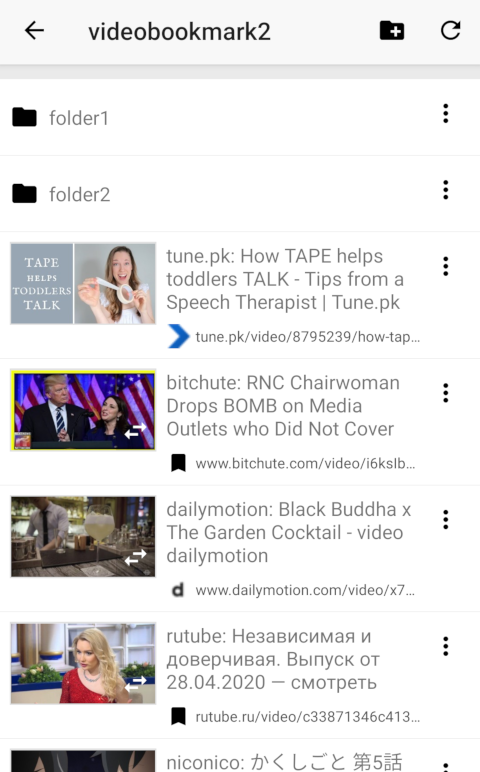
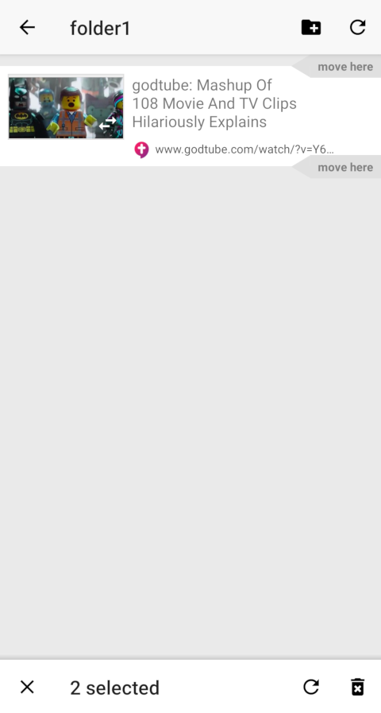
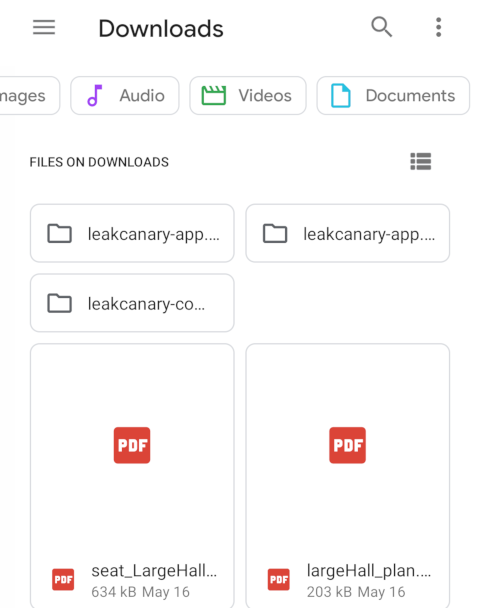
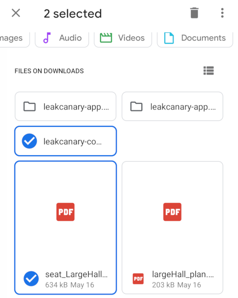
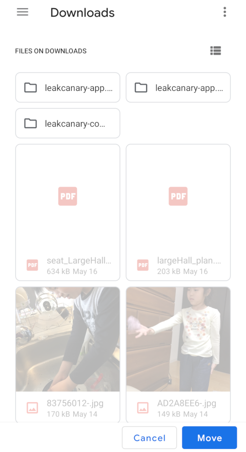
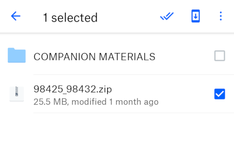
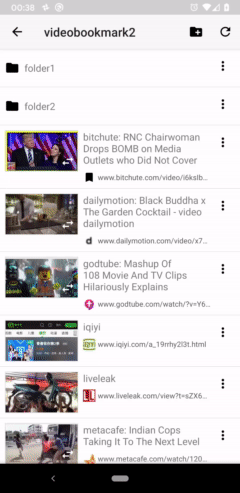
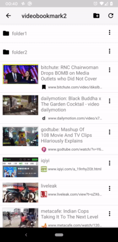
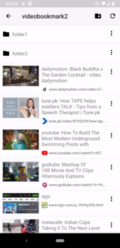

# New mobile UI for file manager type apps

New mobile UI pattern for file manager type apps. It makes moving and reordering files much easier and more intuitive than traditional UI patterns. 

Sample code for Android is available.

# How it works

Long press items to select.

When in selection mode, toolbar is shown at the bottom (not top. It's very important point). And "move here" buttons are shown to move items at the positions.

You can nagivate to other folders even in selection mode.

# Why is it better than other UI patterns?

Let's compare with Google's Files app. It implements traditional item selection UI.

Current folder is shown at the top.

When in selection mode, top bar changes and shows how many items are selected. This implies that you can't change a folder in a selection mode. If you tap a folder, that folder is selected. It doesn't allow you to select files in more than one folders.

When you tap "Move to...", it changes into dedicated destination folder selection mode. When in this mode, you cann't add or remove files from the selection.

Dropbox UI has exactly the same limitation as Files app UI.

# Faster reordering than drag & drop

"move here" buttons in selection mode enables you easy and fast reordering. Drag & drop type reordering is cumbersome especially when moving long distance. 

# Demo app
	
[Video Bookmark](https://play.google.com/store/apps/details?id=app.bookmark.experiment) uses a same UI as described here. 
It's a bookmark manager with thumbnails. It also shows video preview thumbnails for many video sharing sites.

# New UI in action (old)

No more slow scrolling while dragging.

## Move files to a folder

No more dedicated folder selection view. 

## Select files in multiple folders

You can move into a different folder while in selection mode and select multiple files.

