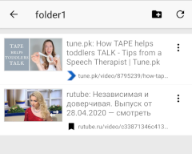

# New UI for file manager type apps

New UI pattern for file manager type apps. It makes moving and reordering files much easier and more intuitive than traditional UI patterns.

Sample code for Android is available.

# Features

## Faster reordering than drag & drop

No more slow scrolling while dragging.

Long tap to select files.

Move to a location to move files to and tap "move here".

Files are moved.

## Move files to a folder

No more dedicated folder selection view. 

Select files and move to a destination folder.

Tap "move here".

Files are moved.

## Select files in multiple folders

You can move into a different folder while in selection mode and select multiple files.

Select a file in Folder1.

Select two more files in Folder2.

Move to a destination folder and tap "move here".

Three files from two different folers are moved here.

# Demo app
	
[Video Bookmark](https://play.google.com/store/apps/details?id=app.bookmark.experiment) uses a same UI as described here. 
It's a bookmark manager with thumbnails. It also shows video preview thumbnails for many video sharing sites.

